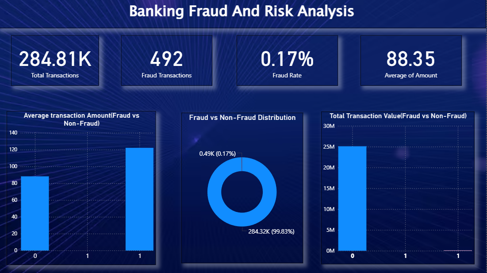

📌 Project Overview

This project analyzes banking transactions to detect fraudulent activities and understand financial risk patterns using Python, SQL, and Power BI.

🛠️ Tools & Technologies:-

	• Python (Pandas, NumPy, Matplotlib, Seaborn)
	• SQL (MySQL)
	• Power BI

📊 Key Insights:-

	• Analyzed 284K+ transactions
	• Fraud rate is only 0.17% (492 transactions), indicating a highly imbalanced dataset
	• Fraud transactions have higher average value (~122 vs ~88) compared to normal transactions
	• Despite low occurrence, fraud contributes to significant financial risk

📈 Dashboard Metrics:-

	• Total Transactions: 284,807
	• Fraud Transactions: 492
	• Fraud Rate: 0.17%
	• Average Transaction Amount: 88.35

📊 Dashboard Preview

📂 Dataset

The dataset used in this project is available on Kaggle:
https://www.kaggle.com/datasets/mlg-ulb/creditcardfraud

Due to large file size, the dataset is not included in this repository.

📁 Project Structure:-

	• fraud_analysis.ipynb → Python data cleaning & EDA
	• fraud_queries.sql → SQL analysis queries
	• dashboard.jpg → Power BI dashboard
